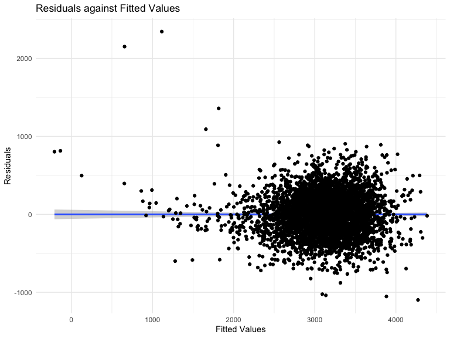

p8105_hw6_yx2858
================
Yueyi Xu
2023-11-28

# Problem 2

``` r
weather_df = 
  rnoaa::meteo_pull_monitors(
    c("USW00094728"),
    var = c("PRCP", "TMIN", "TMAX"), 
    date_min = "2022-01-01",
    date_max = "2022-12-31") |>
  mutate(
    name = recode(id, USW00094728 = "CentralPark_NY"),
    tmin = tmin / 10,
    tmax = tmax / 10) |>
  select(name, id, everything())
```

    ## using cached file: /Users/bellaxyy/Library/Caches/org.R-project.R/R/rnoaa/noaa_ghcnd/USW00094728.dly

    ## date created (size, mb): 2023-09-28 10:23:12.059087 (8.524)

    ## file min/max dates: 1869-01-01 / 2023-09-30

### Create a bootstrap sample function

``` r
set.seed(1)
boot_sample = function(df) {
  sample_frac(df, replace = TRUE)
}
```

### Create 5000 bootstrap samples

``` r
boot_strap_df =
  weather_df |>
  modelr::bootstrap(n = 5000) |>
  mutate(
    models = map(strap, ~lm(tmax ~ tmin + prcp, data = .x)),
    beta = map(models, broom::glance),
    r2 = map(models, broom::tidy)
  ) |>
  unnest(beta, r2) |>
  dplyr::select(.id, term, estimate, r.squared) |>
  pivot_wider(names_from = term, values_from = estimate) |>
  rename(
    beta_0 = '(Intercept)',
    beta_1 = tmin,
    beta_2 = prcp
  )
```

### Identify the 2.5% and 97.5% quantiles to provide a 95% confidence interval for r^2

``` r
r_s = 
  boot_strap_df |>
  select(r.squared) |>
  summarize(
    ci_low = quantile(r.squared, 0.025),
    ci_upp = quantile(r.squared, 0.975)
  )
```

print in table:

``` r
r_s |>
  knitr::kable()
```

|    ci_low |    ci_upp |
|----------:|----------:|
| 0.8885495 | 0.9406812 |

### Plot the distribution of r^2 estimate

``` r
boot_strap_df |>
  select(r.squared) |>
  ggplot(aes(x = r.squared)) +
  geom_density() +
  labs(
    title = "Distribution of r-squared estimates",
    x = "r-squared estimates",
    y = "Density",
    subtitle = "5000 bootstrap samples"
  )
```


Comment: The distribution of the r-squared plot is approximately normal
and slightly skewed to the left with a peak around and slightly higher
to 0.92, indicating the majority of the bootstrap samples are about the
value of 0.92 or close to this value.

### Identify the 2.5% and 97.5% quantiles to provide a 95% confidence interval for $log(\widehat{\beta_1}*\widehat{\beta_2})$

``` r
logbeta = 
  boot_strap_df |>
  mutate(log = log(beta_1 * beta_2)) |>
  drop_na()

log_beta1_beta2 =
  logbeta |>
  select(log) |>
  summarize(
    ci_low = quantile(log, 0.025),
    ci_high = quantile(log, 0.975)
  )
```

print in table:

``` r
log_beta1_beta2 |>
  knitr::kable()
```

|    ci_low |   ci_high |
|----------:|----------:|
| -8.981559 | -4.601673 |

### Plot the distribution of $log(\widehat{\beta_1}*\widehat{\beta_2})$ estimate

``` r
logbeta |>
  select(log) |>
  ggplot(aes(x = log)) +
  geom_density() +
  labs(
    title = "Distribution of log(B1+B2) estimates",
    x = "log(B1+B2) estimates",
    y = "density",
    subtitle = "5000 bootstrap samples"
  )
```


Comment: The distribution of the log(B1+B2) plot is skewed to left with
a peak around -5.5, indicating the majority of the bootstrap samples are
about the values of -5.5 or close to this value.

# Problem 3

### Import data

``` r
birthwt_df = 
  read_csv("birthweight.csv")
```

    ## Rows: 4342 Columns: 20
    ## ── Column specification ────────────────────────────────────────────────────────
    ## Delimiter: ","
    ## dbl (20): babysex, bhead, blength, bwt, delwt, fincome, frace, gaweeks, malf...
    ## 
    ## ℹ Use `spec()` to retrieve the full column specification for this data.
    ## ℹ Specify the column types or set `show_col_types = FALSE` to quiet this message.

### Clean, tidy the data

``` r
birthwt_clean_df =
  birthwt_df |>
  mutate(
    babysex = as.factor(babysex),
    frace = as.factor(frace),
    malform = as.factor(malform),
    mrace = as.factor(mrace)
  ) |>
  janitor::clean_names() |>
  select(bwt, everything())
```

### Check for missing value

``` r
sum(is.na(birthwt_clean_df))
```

    ## [1] 0

There is no missing value in the tidified dataset.

### Propose a regression model for birthweight

``` r
birthwt_mlr = lm(bwt ~., data = birthwt_clean_df)

birthwt_mlr |>
  broom::tidy() |>
  knitr::kable()
```

| term        |      estimate |   std.error |  statistic |   p.value |
|:------------|--------------:|------------:|-----------:|----------:|
| (Intercept) | -6265.3914076 | 660.4010631 | -9.4872522 | 0.0000000 |
| babysex2    |    28.7073088 |   8.4652447 |  3.3911966 | 0.0007021 |
| bhead       |   130.7781455 |   3.4523248 | 37.8811826 | 0.0000000 |
| blength     |    74.9535780 |   2.0216656 | 37.0751613 | 0.0000000 |
| delwt       |     4.1007326 |   0.3948202 | 10.3863301 | 0.0000000 |
| fincome     |     0.2898207 |   0.1795416 |  1.6142265 | 0.1065513 |
| frace2      |    14.3312853 |  46.1501283 |  0.3105362 | 0.7561682 |
| frace3      |    21.2361118 |  69.2959907 |  0.3064551 | 0.7592729 |
| frace4      |   -46.9962310 |  44.6782159 | -1.0518824 | 0.2929123 |
| frace8      |     4.2969242 |  74.0740827 |  0.0580085 | 0.9537446 |
| gaweeks     |    11.5493872 |   1.4653680 |  7.8815609 | 0.0000000 |
| malform1    |     9.7649680 |  70.6258929 |  0.1382633 | 0.8900388 |
| menarche    |    -3.5507723 |   2.8950777 | -1.2264860 | 0.2200827 |
| mheight     |     9.7874130 |  10.3115672 |  0.9491683 | 0.3425881 |
| momage      |     0.7593479 |   1.2221417 |  0.6213256 | 0.5344182 |
| mrace2      |  -151.4354038 |  46.0453432 | -3.2888321 | 0.0010141 |
| mrace3      |   -91.3866079 |  71.9189677 | -1.2706885 | 0.2039079 |
| mrace4      |   -56.4787268 |  45.1368828 | -1.2512766 | 0.2109013 |
| parity      |    95.5411137 |  40.4792711 |  2.3602479 | 0.0183069 |
| pnumlbw     |            NA |          NA |         NA |        NA |
| pnumsga     |            NA |          NA |         NA |        NA |
| ppbmi       |     4.3537865 |  14.8913292 |  0.2923706 | 0.7700173 |
| ppwt        |    -3.4715550 |   2.6121254 | -1.3290155 | 0.1839131 |
| smoken      |    -4.8543629 |   0.5870549 | -8.2690107 | 0.0000000 |
| wtgain      |            NA |          NA |         NA |        NA |

The above MLR is a regression model for birthweight. Each variable in
the dataset is considered as a predictor of the regression model for
birthweight.

### Plot of model residuals against fitted values

``` r
birthwt_clean_df |>
  add_predictions(birthwt_mlr) |>
  add_residuals(birthwt_mlr) |>
  ggplot(aes(x = pred, y = resid)) +
  geom_smooth(method = "lm") +
  geom_point() +
  labs(
    title = "Residuals against Fitted Values",
    x = "Fitted Values",
    y = "Residuals"
  )
```

    ## `geom_smooth()` using formula = 'y ~ x'



From the plot of the residuals against fitted value, the slop is 0,
indicating there is no linear association between residuals against
fitted values.
